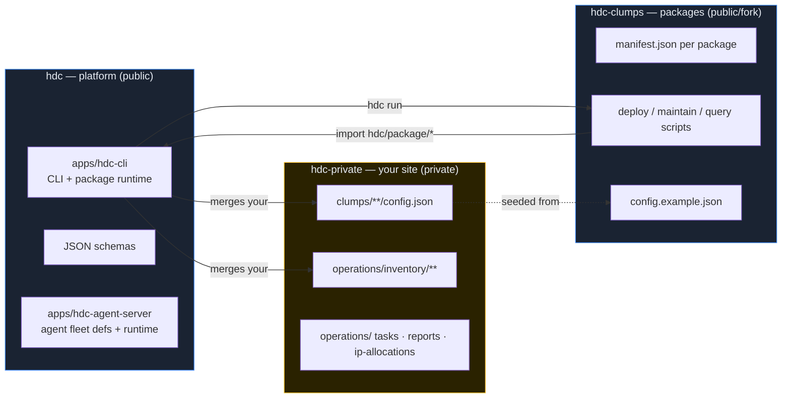
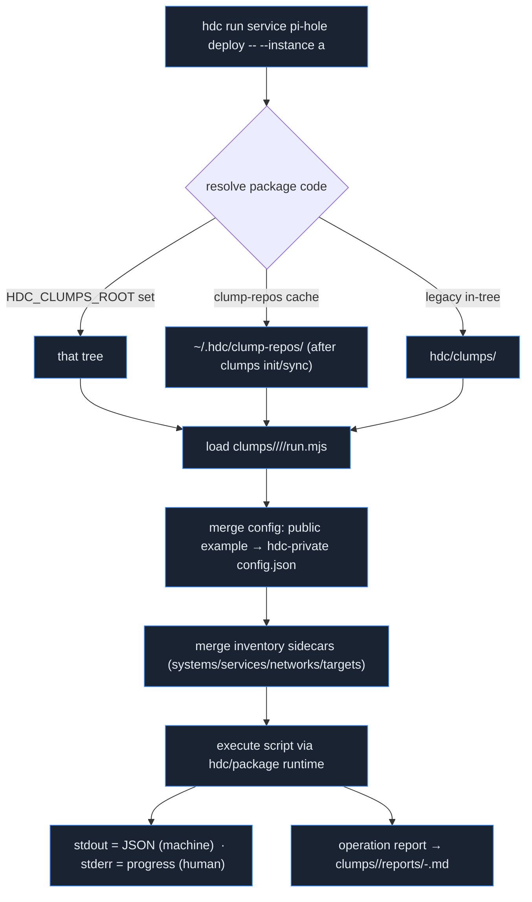
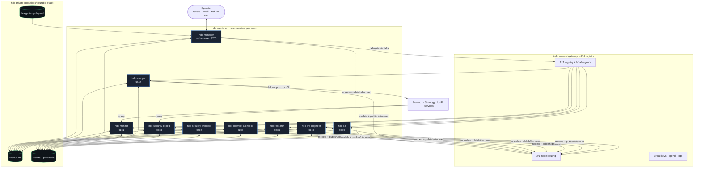
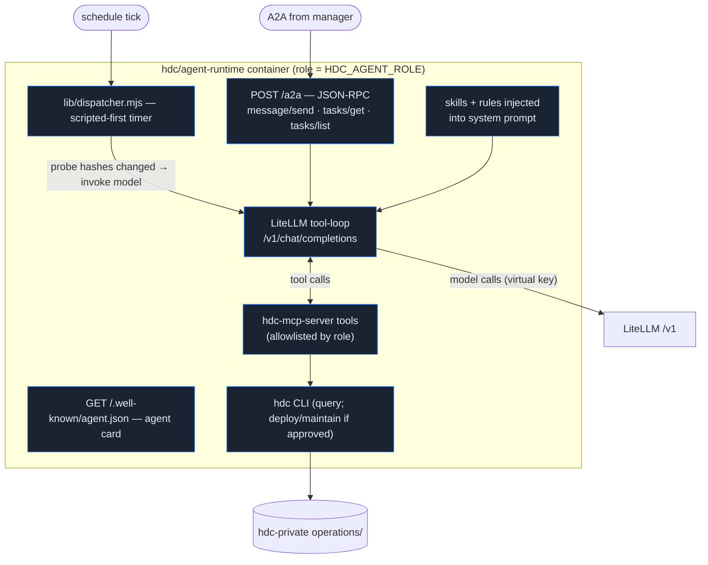
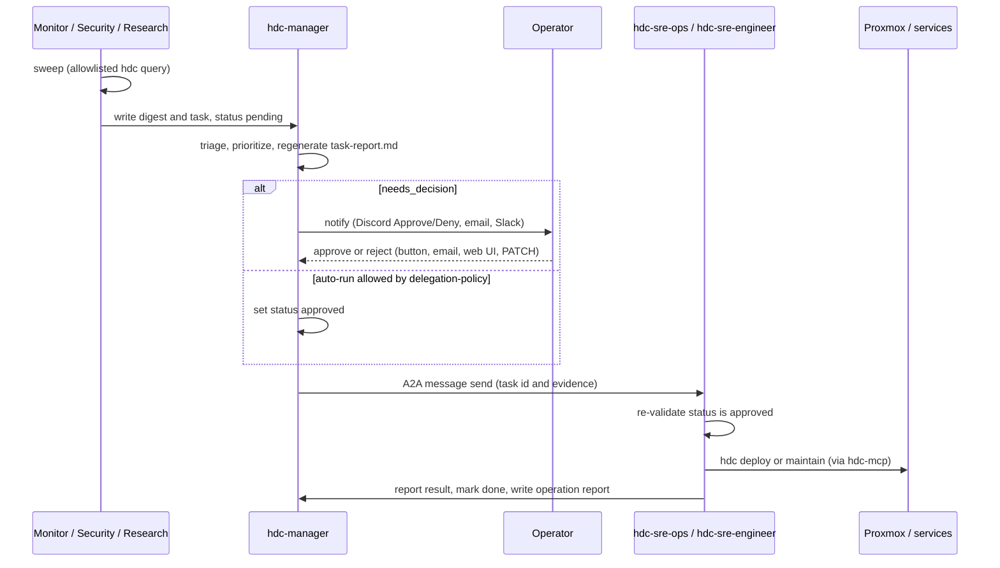
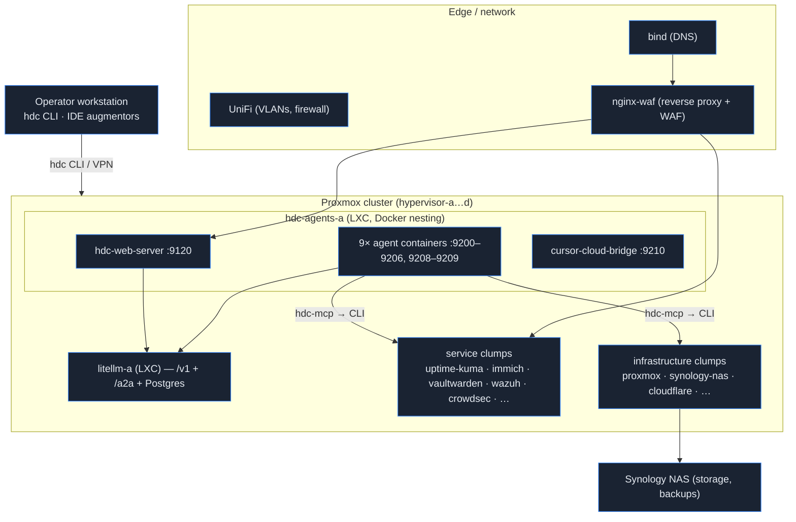

# Home Data Center (HDC) — Architecture

HDC is an automation platform for running a **home lab or small data center** the way
a small SRE team would: everything happens through one tracked CLI, live site data
never leaks into public code, and a fleet of role-specific AI agents helps **build,
secure, monitor, deploy, and maintain** the estate — with a human approving anything
risky.

This document is the map. It explains what HDC is, how the pieces fit, and where to go
for detail. Deeper references:

- [Getting Started](docs/getting-started.md) — build your own HDC from nothing, in five steps
- [Three repositories](docs/three-repos.md) — the repo split and how the CLI resolves paths
- [Multi-agent operations](docs/multi-agent-ops.md) — the full agent roster, handoffs, and rollout
- [Agent server README](apps/hdc-agent-server/README.md) · [Web API](apps/hdc-web-server/API.md) · [MCP server](docs/manually-deployed/hdc-mcp-server.md)
- [AGENTS.md](AGENTS.md) — per-package reference and CLI details

---

## 1. The core ideas

| Idea | What it means |
| --- | --- |
| **Clumps** | A *clump* is a package: a `manifest.json` plus `deploy/`, `maintain/`, `query/` (and optional `teardown/`) scripts for one service or capability. Call it a plugin — the project just had fun naming it. |
| **One CLI** | Every operation runs through `hdc` (Node 18+, standard library only). Agents and humans use the same command surface; every run is logged and reported. |
| **Three repositories** | Platform code, package scripts, and *your* live site data live in three separate git repos so site secrets never touch public trees and routine work never forks the platform. |
| **Files as source of truth** | Inventory, task queue, digests, and proposals are plain files in your private repo — auditable, diffable, and independent of any agent runtime. |
| **Approval gates, not trust** | Destructive verbs (`deploy`, `teardown`, `--prune`, `inventory apply`) require an operator-approved task. Read-only agent roles cannot invoke them at the tool layer, not just by prompt. |
| **No invented facts** | Agents read IPs, topology, and capability from inventory and config. Secrets are referenced by env-var **name**; values live only in an encrypted vault. |

---

## 2. Three repositories

HDC splits into three git repos, each owned by a different build/ops agent (§6).



| Repo | Owns | Required? | You typically… |
| --- | --- | --- | --- |
| **hdc** | CLI, package runtime (`hdc/package/*`), schemas, agent fleet, tests, public docs | Yes (CLI host) | `git pull` for platform updates; run all commands from here |
| **hdc-clumps** | Package manifests + deploy/maintain/query scripts + `config.example.json` | Recommended (or consume upstream via cache) | Fork for site-specific package edits or new services |
| **hdc-private** | Live `config.json`, inventory, IP plans, `operations/` (tasks, digests, plans) | **Yes** | Own all live config and operator state |

On `hdc run`, the CLI loads a package script (from an `hdc-clumps` checkout or the local
clump cache), merges **your** config and inventory from hdc-private, and executes using
shared runtime helpers from hdc. See [three-repos.md](docs/three-repos.md) for the exact
path-resolution rules.

---

## 3. Repository structure (this repo)

```text
hdc/
├── hdc, hdc.cmd                 # CLI entry (./hdc on Unix, hdc.cmd on Windows)
├── apps/
│   ├── hdc-cli/                 # the CLI + package runtime (human/operator-owned)
│   │   ├── cli.mjs              # thin entry → lib/cli-app.mjs
│   │   ├── lib/                 # command logic, package runtime, ~260 modules + tests
│   │   └── schema/              # inventory + per-package config JSON schemas
│   ├── hdc-agent-server/        # fleet agent runtime (A2A + dispatcher)
│   │   ├── server.mjs           # one A2A server per agent role
│   │   ├── agents/              # 9 role prompts (canonical)
│   │   ├── skills/  rules/  automations/
│   │   └── lib/                 # dispatcher, LiteLLM client, task queue, mailbox
│   ├── hdc-mcp-server/          # MCP tool surface over the CLI (allowlisted)
│   ├── hdc-web-server/          # LAN web UI (React) + JSON REST API (:9120)
│   │   └── web/src/ui/          # extracted design system (16 components)
│   └── hdc-augment-bridge/      # A2A wrapper for Cursor Cloud / Cursor CLI / Claude Code
├── operations/inventory/        # sidecars — _example only here; real data in hdc-private
├── docs/                        # architecture, three-repos, per-service manually-deployed notes
├── .cursor/                     # canonical IDE rules/skills/agents (Cursor reads directly)
├── .claude/  CLAUDE.md          # Claude Code thin pointers into .cursor/ + fleet defs
└── AGENTS.md                    # full repo map, CLI reference, per-package docs
```

The five apps and their jobs:

| App | What it does | Runs where |
| --- | --- | --- |
| **hdc-cli** | The `hdc` command + package runtime. All deploy/maintain/query flows. | Operator workstation and every agent container |
| **hdc-agent-server** | An A2A HTTP server hosting **one** agent role; scripted dispatcher + LiteLLM tool-loop. | One container per agent on `hdc-agents-a` |
| **hdc-mcp-server** | MCP server exposing a **safe, allowlisted** slice of the CLI as tools, gated per role. | In-process/stdio inside each agent container |
| **hdc-web-server** | LAN web UI + REST API for tasks, jobs, schedules, inventory, research. | `hdc-agents-a` `:9120` |
| **hdc-augment-bridge** | A2A server wrapping IDE/cloud coding agents so fleet roles can delegate package-code subtasks (hdc-clumps). | Fleet sidecar + operator workstation |

---

## 4. The CLI and package runtime

`hdc` is the single entry point. Package scripts are plain Node modules that import
shared runtime via `hdc/package/*` (resolved by a CLI import hook / preload).

**Top-level commands** (from [`apps/hdc-cli/lib/cli-app.mjs`](apps/hdc-cli/lib/cli-app.mjs)):

| Command | Purpose |
| --- | --- |
| `list` | Packages and manifest metadata |
| `run <tier> <clump> <verb> [-- args]` | Run a package script; tier ∈ `client` · `infrastructure` · `service`; verb ∈ `deploy` · `maintain` · `query` (`teardown` where defined) |
| `maintain daily` | Cross-package, non-destructive daily recipe (aggregated report) |
| `clumps init \| list \| sync` | Bootstrap/refresh the package (clump) cache |
| `secrets …` | Encrypted vault for `HDC_*` secrets (`~/.hdc/vault.enc`) |
| `users bootstrap-hdc` | Ensure the local `hdc` automation user on bootstrap hosts |
| `env` | Print `HDC_*` variables (sensitive values redacted) |

**How `hdc run` resolves and executes:**



Key contracts: **stdout stays clean JSON** for `query`/`deploy`/`teardown`;
human-facing progress goes to **stderr**; every `deploy`/`maintain`/`teardown` writes a
markdown **operation report**. Inventory is JSON sidecars discriminated by `kind`
(`system`, `network`, `target`, `services`), validated against
[`apps/hdc-cli/schema/`](apps/hdc-cli/schema/).

---

## 5. The agent fleet

The fleet turns "a small SRE team" into always-on services. **Hub-and-spoke:** the
Manager is the only agent that assigns work and talks to the operator; specialists do
not assign work to each other **except** `hdc-sre-engineer` may queue research via
`hdc_request_research`. Coordination flows through **task files** in hdc-private,
not chat context.



### Roster (9 roles)

| Agent | Lifecycle | Access | Trigger |
| --- | --- | --- | --- |
| `hdc-manager` | Orchestrate | Task files, notifications, A2A delegation | Hourly triage + A2A + on demand |
| `hdc-monitor` | **Monitor** | Query-only + digests/tasks | 4 h sweep + A2A |
| `hdc-sre-ops` | **Deploy / Maintain** (live) | Full hdc CLI on approved tasks; hdc-private writes | Per approved task |
| `hdc-sre-engineer` | **Build** (packages) | hdc-clumps scripts; read-only `query` | Failure reports, scaffolds |
| `hdc-security-expert` | **Secure** (detect/respond) | Query + pre-approved bouncer sync | 6 h sweep + incidents |
| `hdc-security-architect` | **Secure** (plan) | Read-only + `proposals/security/` | Weekly / post-incident |
| `hdc-network-architect` | **Build** (network design) | Read-only + `proposals/network/` | On demand (A2A) |
| `hdc-research` | **Build** (discovery) | Read-only + `hdc_web_*` + augmentors | Queued topics (incl. sre-engineer requests) + weekly brief |
| `hdc-qa` | **Build** (quality) | `hdc_validate_clump`, query/health, augmentors | After scaffold; before deploy |
| `hdc-ops` | Legacy alias | — | Deprecated; defers to sre-ops/manager |

Canonical definitions live in [`apps/hdc-agent-server/agents/`](apps/hdc-agent-server/agents/);
`.cursor/agents/` and `.claude/agents/` are thin pointers for IDE sessions.

### Repository ownership → build/ops roles

| Repository | Owner | Handoff on failure |
| --- | --- | --- |
| **hdc** (platform) | Human / operator | CLI/platform gaps → escalate to operator (`needs_decision`) |
| **hdc-clumps** (packages) | `hdc-sre-engineer` | Clump script fails → `hdc-sre-engineer` commits/pushes → `hdc-manager` runs `hdc_clumps_sync` → `hdc-sre-ops` runs approved live op |
| **hdc-private** (site) | `hdc-sre-ops` | Live config/state; executes approved deploy/maintain |

---

## 6. Inside one agent container

Each agent is its **own Docker container** (built from the shared `hdc/agent-runtime`
image) so it can be resourced, restarted, upgraded, and revoked independently. The
container runs [`apps/hdc-agent-server/server.mjs`](apps/hdc-agent-server/server.mjs) for a
single role.



**Scripted-first dispatcher.** Most ticks are deterministic and never call the model:
- **Manager** refreshes `task-report.md`, notifies on `needs_decision`, and A2A-delegates
  approved work; the LLM runs only when new digests/failure reports appear.
- **Monitor / security** run allowlisted `hdc` queries; the LLM runs only when the
  combined probe-output hash changes.
- **Research** invokes the model only when today's brief is missing.

Default schedules: manager 15 m · monitor 60 m · security 120 m · research 7 d. This
"spend control" keeps model cost tied to real change, and **per-agent LiteLLM virtual
keys** attribute every model + A2A call to a role (revoke a key = disable that agent).

**Config** is by env-var name only (values from vault at render time): `HDC_AGENT_ROLE`,
`HDC_AGENT_PORT` (9200–9206, 9208–9209), `HDC_LITELLM_BASE_URL`, `HDC_AGENT_LITELLM_KEY`,
`HDC_PRIVATE_ROOT`, `HDC_AGENT_MODEL`.

---

## 7. Task lifecycle & coordination

Task files (`operations/tasks/<id>.md`, YAML frontmatter) are the auditable system of
record. A2A messages *trigger* work; the files *decide* it.



**Status:** `pending → approved → in_progress → blocked/done`. **Escalation** routes via
[`notifications.routes`](docs/manually-deployed/manager-notifications.md) (Discord with
Approve/Deny buttons, email to `manager@hdc.dukk.org`, Slack, Teams, Telegram). Digests
land in `operations/reports/`; read-only architects write to `operations/proposals/`.

---

## 8. LiteLLM: model gateway + A2A registry

The deployed **`litellm`** clump is the control plane, replacing the old in-memory
`a2a-registry` service. It provides model routing (`/v1`, OpenAI-compatible), virtual-key
auth, spend/logging, **and** an A2A gateway that fronts registered agents.

- **Publish** — each agent is registered declaratively in hdc-private
  `clumps/services/litellm/config.json` → `a2a_agents[]` (name, container URL,
  description). Registration survives restarts because it lives in config, not a runtime
  API call.
- **Discover** — the Manager lists agent cards from LiteLLM, filters by advertised
  capabilities, and sends the task to `https://litellm.example/a2a/<agent>`; LiteLLM
  authenticates, logs, and proxies to the target container.
- **Augmentors** — IDE/cloud coding agents (Cursor Cloud, Cursor CLI, Claude Code) are
  registered with `kind: augmentor`. `hdc-sre-engineer` (and other allowed roles)
  delegate package-code subtasks (**hdc-clumps** only) via MCP `hdc_list_augmentors` +
  `hdc_delegate_augment`, bridged by
  [hdc-augment-bridge](docs/manually-deployed/hdc-augment-bridge.md).

---

## 9. API surfaces

### hdc-mcp-server (agent tool surface)

Allowlisted slice of the CLI, gated per role via `HDC_AGENT_ROLE`
([`policy.mjs`](apps/hdc-mcp-server/lib/policy.mjs)). Secrets, `deploy`, `teardown`, and
destructive flags are blocked for read-only roles.

| Tool | Purpose |
| --- | --- |
| `hdc_list` · `hdc_help` | Discover packages / usage |
| `hdc_run` | Run a package verb (query always; maintain/deploy gated by policy + approval) |
| `hdc_maintain_daily` | Non-destructive daily recipe |
| `hdc_clumps_sync` | Manager-only: pull package code onto the fleet host |
| `hdc_notify_discord` | Send an operator notification |
| `hdc_list_augmentors` · `hdc_delegate_augment` | Delegate code fixes to IDE/cloud agents |

### hdc-web-server (LAN REST API, `:9120`)

React SPA + JSON API. **Auth:** bearer token (agents), encrypted-htpasswd password login,
or OIDC/Keycloak SSO. Full reference: [API.md](apps/hdc-web-server/API.md).

| Group | Routes |
| --- | --- |
| Auth | `/api/auth/{me,login,logout,oidc/login,oidc/callback}` |
| Schedules | `GET /api/schedules`, `/:id/log`, `POST /:id/run` |
| Jobs | `GET/POST /api/jobs`, `GET /api/jobs/:id` (default policy exposes only `query`/`maintain`) |
| Packages | `GET /api/packages` (filtered by `allowed_verbs`) |
| Inventory | `GET /api/inventory/:category[/:id]` (read-only) |
| Agent tasks | `GET /api/tasks`, `/report`, `/:id`; `PATCH /:id` (approve/block); `POST /:id/run` |
| Research | `GET /api/research`; `POST /api/research/suggestions` |
| Discord | `POST /api/discord/interactions` (Ed25519-verified Approve/Deny buttons) |

### hdc-agent-server (A2A, per container)

`GET /.well-known/agent.json` (card) · `GET /health` · `POST /a2a` (JSON-RPC:
`message/send`, `tasks/get`, `tasks/list`).

---

## 10. Deployment topology

Everything runs on a **Proxmox** cluster as LXC containers or QEMU VMs, provisioned and
maintained by the hdc CLI. Site IPs live only in hdc-private.



- **`hdc-agents-a`** — the fleet host: `hdc-web-server` (tasks/jobs UI), one container per
  agent role, and optional augmentor sidecars. No separate runner guest.
- **`litellm-a`** — model gateway + A2A registry/gateway (LXC + Docker + Postgres).
- **Service & infrastructure clumps** — each its own LXC/QEMU guest, deployed and kept to
  a common baseline (automation user, ClamAV, unattended-upgrades, CrowdSec/Wazuh agents,
  mail relay) by `maintain`.
- **Edge** — UniFi for VLANs/firewall, `bind` for DNS, `nginx-waf` for reverse proxy + WAF.
- The A2A gateway is **LAN + VPN only** in v1; public exposure is a later explicit decision.

---

## 11. Security & trust model

- **Approval gates.** `deploy`/`teardown`/`--prune`/`inventory apply` need a task with
  `status: approved` per [`delegation-policy.md`](docs/multi-agent-ops.md). Read-only roles
  can't invoke them at the MCP tool layer — enforcement is structural, not prompt-based.
- **Least privilege.** Per-role MCP allowlists; per-agent LiteLLM virtual keys for
  identity, audit, and a per-agent kill switch.
- **Secrets discipline.** Values live only in the encrypted vault (`~/.hdc/vault.enc`);
  inventory and config reference **env-var names**. `.claude/settings.json` denies the
  `secrets` CLI and `.env`/vault reads as a backstop. Public trees carry RFC 5737
  documentation IPs only — real site addresses stay in hdc-private.
- **Deterministic where it matters.** `maintain daily` and `run-daily` are deterministic
  (no LLM); agents handle triage, judgment, and code — never bypassing the task/approval
  protocol on any runtime (IDE, cron, or A2A).

---

## 12. Design system

The `hdc-web-server` UI is built from an extracted 16-component design system under
[`apps/hdc-web-server/web/src/ui/`](apps/hdc-web-server/web/src/ui/) (Button, Tabs,
StatCard, Table, Panel, Field, StatusText, LogView, …) driven by a small token set
(9 colors, dark theme). It is synced to claude.ai/design via
[`/design-sync`](apps/hdc-web-server/.design-sync/) so UI work stays on-brand and maps 1:1
onto shippable components.

---

*For the full agent rollout plan, coordination contract, and gap analysis, see
[docs/multi-agent-ops.md](docs/multi-agent-ops.md). For per-package details and the
complete CLI reference, see [AGENTS.md](AGENTS.md).*
