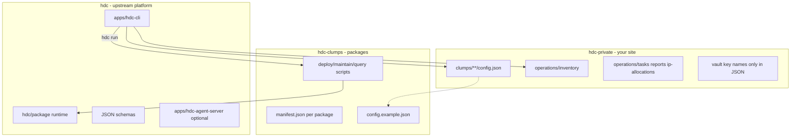

# Three repositories

HDC splits automation into three git repositories so you can run a homelab or small data center **without putting site-specific data in public trees**, and **without forking the platform** for routine work.

| Layer | Repository | Role |
| --- | --- | --- |
| Platform | [**hdc**](https://github.com/dukk/hdc) | CLI, shared package runtime, JSON schemas, optional agent fleet |
| Packages | [**hdc-clumps**](https://github.com/dukk/hdc-clumps) | Deploy / maintain / query scripts, manifests, `config.example.json` |
| Your site | **hdc-private** (your private repo) | Live `config.json`, inventory, IP plans, tasks, operation reports |

**Minimum to operate:** clone **hdc** and create **hdc-private**. Package code can come from upstream via `hdc clumps init` (no hdc-clumps checkout required).

**Alternative:** depend on `@dukk/hdc-cli` from GitHub Packages in your private operator repo (no hdc git checkout). See [npm workspace](npm-workspace.md).

**Recommended:** also maintain **your own hdc-clumps fork** when you customize package scripts or add services. Day-to-day edits should stay in hdc-private (and your hdc-clumps fork); **pull hdc for platform updates** rather than maintaining a long-lived hdc fork.

## Architecture



On `hdc run`, the CLI loads a package script from hdc-clumps (or cache), merges **your** config and inventory from hdc-private, and executes using shared helpers from hdc.

### Fleet runtime (hdc-agents)

On the hdc-agents guest, package scripts run from the **local clump cache** (`~/.hdc/clump-repos/` after `hdc clumps init` / `sync`), not directly from a git checkout. **hdc-sre-engineer** commits and pushes hdc-clumps changes; **hdc-manager** pulls them onto the MCP host via `hdc_clumps_sync` before **hdc-sre-ops** runs approved deploy/maintain. Human operators may still run `hdc clumps sync` on their workstation.

## Repository roles

| Repo | Required? | You typically… | Upstream relationship |
| --- | --- | --- | --- |
| **hdc** | Yes (CLI host) | Clone, `git pull` for platform updates; run all commands from here | Track [dukk/hdc](https://github.com/dukk/hdc); avoid long-lived forks unless contributing platform changes |
| **hdc-private** | **Yes** | Own all live configs, inventory, IP plans, tasks | **Your private git repo** — never commit operator data to hdc |
| **hdc-clumps** | Recommended | Fork for site-specific package edits or new packages; or consume upstream via cache | Fork [dukk/hdc-clumps](https://github.com/dukk/hdc-clumps) or pin upstream in [`.hdc/clumps-repos.json`](../.hdc/clumps-repos.json) |

Routine operations should **not** require hdc changes. Configure the site in **hdc-private**; customize automation in **your hdc-clumps** when needed; treat **hdc** as an upstream dependency.

## How the CLI resolves paths

Package code and operator data use **independent** resolution (see [`apps/hdc-cli/lib/clump-repos.mjs`](../apps/hdc-cli/lib/clump-repos.mjs) and [`apps/hdc-cli/lib/private-repo.mjs`](../apps/hdc-cli/lib/private-repo.mjs)).

### Package code (clumps)

1. **`HDC_CLUMPS_ROOT`** — if set and the path exists, use that tree only.
2. **Clump repos** — entries in `.hdc/clumps-repos.json` (merged from hdc and hdc-private when present), cloned under `~/.hdc/clump-repos/` after `hdc clumps init` / `hdc clumps sync`.
3. **Legacy** — in-tree `hdc/clumps/` if it still exists (older layouts).

Manifest discovery respects `precedence` and per-package `overrides` in `.hdc/clumps-repos.json`. Environment overrides: `HDC_CLUMPS_REPO_<ID>_URL` and `HDC_CLUMPS_REPO_<ID>_REF`. Lasting pins belong in **hdc-private** `.hdc/clumps-repos.json` (`ref` = branch, tag, or commit). Sync with `hdc clumps sync --ref <x>` (persists by default; `--no-persist` for a one-shot) or manager MCP `hdc_clumps_sync` with the same semantics.

### Operator data (configs, inventory)

For a repo-relative path such as `clumps/services/pi-hole/config.json` or `operations/inventory/systems/pi-hole-a.json`:

1. **Public hdc** — if the file exists under the hdc checkout, use it (rare for adopters; useful for local experiments).
2. **hdc-private** — same relative path under `../hdc-private` or `HDC_PRIVATE_ROOT`.
3. **Missing** — error, or optional skip (some `query` scripts report `config missing`).

Clump `.env` files follow the same merge: hdc public first, then hdc-private.

### Secrets

Secrets never belong in git:

- **Global CLI settings** — hdc root `.env` (copy from `.env.example`): vault passphrase, `HDC_PRIVATE_ROOT`, secret backend, Discord webhooks, etc.
- **Package env** — `clumps/<tier>/<id>/.env` in hdc-private (see each package `.env.example` in hdc-clumps).
- **Encrypted vault** — `~/.hdc/vault.enc` via `hdc secrets` (optional Vaultwarden backend; see [Bitwarden CLI](manually-deployed/bitwarden-cli.md)).

JSON config and inventory reference vault keys by **name** only (for example `HDC_PROXMOX_API_TOKEN`), never values.

## Setup

### Option: npm operator workspace (no hdc git clone)

Use a private repo that depends on `@dukk/hdc-cli` and holds the same paths as hdc-private.
Template: [`templates/hdc-private-workspace/`](../templates/hdc-private-workspace/). Guide: [npm workspace](npm-workspace.md).

```bash
cp -r templates/hdc-private-workspace my-hdc-site && cd my-hdc-site
cp .npmrc.example .npmrc   # GITHUB_TOKEN with read:packages
npm install
cp .env.example .env       # HDC_PRIVATE_ROOT=.
npx hdc clumps init
npx hdc list
```

### Minimum: hdc + hdc-private

Typical directory layout:

```text
~/your-org/hdc
~/your-org/hdc-private
```

Steps from the **hdc** repo root:

```bash
git clone https://github.com/dukk/hdc.git
cd hdc
cp .env.example .env
# If hdc-private is not ../hdc-private:
# HDC_PRIVATE_ROOT=/path/to/hdc-private

# Create an empty private repo, clone beside hdc, then seed configs from examples:
node apps/hdc-cli/scripts/bootstrap-hdc-private-configs.mjs

# Pull upstream package code into ~/.hdc/clump-repos/ (no hdc-clumps clone required):
hdc clumps init
hdc clumps sync

# Initialize secrets on the operator machine:
hdc secrets init
hdc secrets set HDC_PROXMOX_API_TOKEN   # example; set keys your packages need

# Edit IPs, hostnames, and inventory in hdc-private only.
# Verify:
hdc list
hdc run infrastructure proxmox query --
```

Use RFC 5737 documentation addresses (`192.0.2.x`) and `example.invalid` domains in any **public** forks or examples so you do not publish a real LAN.

### Recommended: add your own hdc-clumps

```text
~/your-org/hdc
~/your-org/hdc-private
~/your-org/hdc-clumps    # your fork
```

1. Fork [hdc-clumps](https://github.com/dukk/hdc-clumps) and clone as a sibling.
2. Point the CLI at your fork — either:
   - Set `HDC_CLUMPS_ROOT` in hdc `.env` to the absolute path of your checkout, **or**
   - Edit `.hdc/clumps-repos.json` (in hdc or hdc-private) so `repos[].url` is your fork URL.
3. Customize package scripts and add packages in **your** hdc-clumps; keep live `config.json` and inventory in **hdc-private**.
4. Open [`hdc.code-workspace`](../hdc.code-workspace) in VS Code or Cursor for multi-root editing across all three trees.

When upstream hdc-clumps adds packages, run `hdc clumps sync` and bootstrap any new examples:

```bash
node apps/hdc-cli/scripts/bootstrap-hdc-private-configs.mjs
```

## What belongs where

| Artifact | hdc | hdc-clumps | hdc-private |
| --- | --- | --- | --- |
| CLI, schemas, agent fleet | Yes | No | No |
| Package scripts (`deploy/`, `maintain/`, `query/`) | No | Yes | No |
| `manifest.json`, `config.example.json` | No | Yes | Optional copy |
| `config.json` | **Never** | **Never** | Yes |
| `.env` | `.env.example` only | `.env.example` only | Yes |
| `operations/inventory/**` | `_example.json` only | No | Yes |
| `operations/tasks/`, `ip-allocations.md`, reports | No | No | Yes |
| Deploy/maintain reports under `clumps/**/reports/` | No (gitignored) | No (gitignored) | Yes |
| Human docs (`docs/`) | Yes | Optional package READMEs | Ops notes under `operations/` |
| Agent OKF (`ai-docs/`) | No | No | Yes (platform + package + site) |

**docs vs ai-docs:** [`docs/`](./) is human-oriented prose. Agent [Open Knowledge Format](https://github.com/GoogleCloudPlatform/knowledge-catalog/blob/main/okf/SPEC.md) (markdown + YAML frontmatter) lives only under **hdc-private** [`ai-docs/`](../../hdc-private/ai-docs/) — start at `ai-docs/index.md` there. Do not put `ai-docs/` in public hdc or hdc-clumps trees.

Full checklists:

- [Public repo policy (hdc)](manually-deployed/public-repo-policy.md)
- [Public repo policy (hdc-clumps)](https://github.com/dukk/hdc-clumps/blob/main/docs/manually-deployed/public-repo-policy.md)

## Day-to-day workflow

1. **Discover** — `hdc list`; read the package README under hdc-clumps (`services/<id>/README.md`, etc.).
2. **Configure** — edit hdc-private `clumps/<tier>/<id>/config.json` and `operations/inventory/` sidecars; maintain `operations/ip-allocations.md` for static IPs.
3. **Plan** — for new deploys, write `hdc-private/clumps/services/<id>/plan.md` and get approval before `deploy` or destructive `maintain`.
4. **Run** — `hdc run <tier> <clump> query|deploy|maintain -- [flags]` (Windows: `hdc.cmd`).
5. **Schedule** — `hdc maintain daily` on an operator workstation (Task Scheduler, cron, or automation agent).

Detailed CLI and per-package reference: [AGENTS.md](../AGENTS.md).

## When to change each repo

| Need | Where to edit |
| --- | --- |
| New static IP, VMID, hostname, DNS zone data | hdc-private |
| Tweak a deploy script, add a service package | Your hdc-clumps fork |
| CLI bug, new schema, agent fleet feature | hdc (upstream PR or short-lived fork) |
| New secret value | Operator vault / `.env` (not git) |

## Optional: agent fleet

You do not need the agent fleet for basic CLI operation. If you deploy **hdc-agents**:

- Runtime and agents live in hdc (`apps/hdc-agent-server/`).
- The guest mounts hdc-private at `/opt/hdc-private` for tasks, inventory, and guest-authoritative ops state.
- Approvals and task files: hdc-private `operations/tasks/`.

See [multi-agent operations](multi-agent-ops.md).

## Related

- [hdc-private README](../../hdc-private/README.md) — layout, bootstrap, migration
- [hdc-clumps README](https://github.com/dukk/hdc-clumps/blob/main/README.md) — package catalog
- [AGENTS.md](../AGENTS.md) — CLI reference and package summaries
- [Bitwarden CLI / Vaultwarden secrets](manually-deployed/bitwarden-cli.md)
